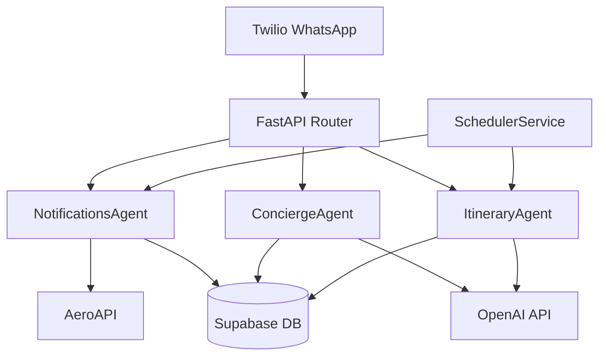

# 🏗️ Bauhaus Travel - Technical Architecture Overview

**Author**: Senior Technical Lead Analysis  
**Date**: 2025-01-16  
**Version**: Post-Refactorization Analysis  
**Target Audience**: External developers, technical leads, system architects

---

## 📋 **EXECUTIVE SUMMARY**

Bauhaus Travel is an **autonomous agent-based travel assistant** built around three core intelligent agents that handle different aspects of the travel experience. The system underwent a major refactorization in January 2025, eliminating over-engineering and focusing on core functionality that actually works.

**Core Value Proposition**: Autonomous travel assistance via WhatsApp with real-time flight monitoring, AI-powered conversations, and automatic itinerary generation.

**Key Statistics**:
- 3 autonomous agents (Notifications, Concierge, Itinerary)
- 11 core files (reduced from 50+)
- WhatsApp integration via Twilio
- Real-time flight data via AeroAPI
- AI-powered conversations via OpenAI GPT-4o mini

---

## 🧠 **SYSTEM ARCHITECTURE**

### **Agent-First Design Philosophy**



### **Architectural Principles**

1. **Autonomous Agents**: Each agent operates independently with clear boundaries
2. **No Agent-to-Agent Communication**: Only the scheduler/router can invoke agents
3. **Single Responsibility**: Each agent handles one domain of travel assistance
4. **External API Integration**: Agents interface with external services (Twilio, AeroAPI, OpenAI)
5. **Centralized Data**: All agents share the same Supabase database but with clear data ownership

### **Technology Stack**

| Layer | Technology | Purpose |
|-------|------------|---------|
| **API Framework** | FastAPI + uvicorn | HTTP REST API with async support |
| **Database** | Supabase (PostgreSQL) | Trip data, conversations, itineraries |
| **Agent Communication** | Structured JSON | Internal agent responses |
| **External APIs** | Twilio, AeroAPI, OpenAI | WhatsApp, flight data, AI |
| **Scheduling** | APScheduler | Background task automation |
| **Logging** | structlog | Structured JSON logging |

---

## 🤖 **AGENT ANALYSIS**

## **1. NotificationsAgent** 

### **Purpose & Responsibility**
The NotificationsAgent is the **proactive communication hub** responsible for sending timely, contextual WhatsApp notifications about flight status changes and travel updates.

### **Core Functionality**
- **Template-based messaging**: Uses approved Twilio WhatsApp templates
- **Real-time flight monitoring**: Polls AeroAPI for status changes
- **Smart scheduling**: Intelligent timing based on departure proximity
- **Notification logging**: Complete audit trail of all sent messages

### **Architecture Details**

**Key Methods**:
```python
async def run(trigger_type: str, **kwargs) -> DatabaseResult
async def send_single_notification(trip_id: UUID, notification_type: NotificationType)
async def poll_flight_changes() -> DatabaseResult
async def schedule_24h_reminders() -> DatabaseResult
```

**Template System**:
- `confirmacion_reserva` - Booking confirmations
- `recordatorio_24h` - 24-hour flight reminders  
- `embarcando` - Boarding notifications with gate info
- `demorado` - Flight delay notifications
- `cambio_gate` - Gate change alerts
- `cancelado` - Flight cancellation notices

**Polling Logic**:
```
> 24h before departure: Every 6 hours
24h - 4h before: Every 1 hour  
< 4h before: Every 15 minutes
In-flight: Every 30 minutes
```

### **Data Dependencies**
- **Input**: `trips` table (flight details, departure times)
- **External**: AeroAPI for real-time flight status
- **Output**: `notifications_log` table (delivery tracking)

### **Integration Points**
- **Twilio WhatsApp**: Message delivery via approved templates
- **AeroAPI**: Flight status monitoring and gate information
- **SchedulerService**: Automatic polling and reminder scheduling

### **🎯 Strengths**
1. **Real-time accuracy**: Gets actual gate information from AeroAPI
2. **Intelligent timing**: Respects quiet hours (09:00-20:00 local time)
3. **Comprehensive logging**: Full audit trail for debugging
4. **Template compliance**: Uses Twilio-approved templates only
5. **Automatic polling**: No manual intervention required

### **⚠️ Identified Flaws & Issues**
1. **Landing detection placeholder**: `poll_landed_flights()` is not implemented
2. **No retry logic**: If Twilio fails, notification is lost (deleted during refactorization)
3. **Single AeroAPI key**: No failover if AeroAPI is down
4. **Memory-only caching**: Cache is lost on server restart
5. **Template rigidity**: Cannot send custom messages for unique situations

### **🚀 Improvement Recommendations**

**High Priority**:
1. **Implement landing detection**: Use AeroAPI `actual_in` field to detect arrivals
2. **Add basic retry logic**: Simple exponential backoff for Twilio failures
3. **Enhanced error handling**: Graceful degradation when AeroAPI is unavailable

**Medium Priority**:
1. **Template variables validation**: Ensure all required template variables are available
2. **Rate limiting**: Protect against AeroAPI rate limits
3. **Notification deduplication**: Prevent sending duplicate notifications

**Low Priority**:
1. **Redis caching**: Persistent cache for flight status data
2. **Multiple AeroAPI keys**: Failover capability
3. **Dynamic templates**: Support for custom message content

### **🧪 Testing Strategy**
```bash
# Test notification sending
python scripts/test_system_integration.py

# Test with real flight data
curl -X POST /trips -d '{"flight_number":"DL110","departure_date":"2025-07-05T20:10:00Z",...}'
```

---

## **2. ConciergeAgent**

### **Purpose & Responsibility**
The ConciergeAgent is the **conversational AI interface** that handles inbound WhatsApp messages, understands user intent, and provides intelligent, contextual responses using complete trip information.

### **Core Functionality**
- **Intent detection**: Classifies user messages into specific categories
- **Context loading**: Retrieves complete trip, itinerary, and conversation history
- **AI response generation**: Uses OpenAI GPT-4o mini for natural language responses
- **Document access**: Can reference and provide links to travel documents
- **Real-time flight status**: Integrates with AeroAPI for current flight information

### **Architecture Details**

**Key Methods**:
```python
async def handle_inbound_message(whatsapp_number: str, message_body: str) -> DatabaseResult
async def _detect_intent(message: str) -> Optional[str]
async def _handle_intent_based_response(trip: Trip, message: str, intent: str) -> str
async def _load_conversation_context(trip: Trip) -> Dict[str, Any]
async def _generate_ai_response(context: Dict, user_message: str) -> str
```

**Intent Detection System**:
- `boarding_pass_request` - "boarding pass", "pase de embarque"
- `flight_info_request` - "vuelo", "estado", "gate"
- `itinerary_request` - "itinerario", "plan", "actividades"
- `document_request` - "hotel", "seguro", "transfer"
- `help_request` - "ayuda", "help", "que puedes"
- `greeting` - "hola", "hello", "buenos"
- `general_query` - Everything else → AI processing

**Context Loading Strategy**:
```python
# Loads in parallel via optimized database queries
context = {
    'trip': trip_data,
    'itinerary': parsed_itinerary_data,
    'documents': user_documents,
    'recent_messages': conversation_history
}
```

### **Data Dependencies**
- **Input**: `trips`, `conversations`, `documents`, `itineraries` tables
- **External**: OpenAI GPT-4o mini for AI responses, AeroAPI for real-time flight status
- **Output**: `conversations` table (bidirectional message logging)

### **Integration Points**
- **Twilio Webhook**: Receives inbound WhatsApp messages
- **OpenAI API**: Generates contextual AI responses
- **AeroAPI**: Real-time flight status for flight info requests
- **NotificationsAgent**: Sends response messages via free-text messaging

### **🎯 Strengths**
1. **Real-time flight data**: Shows current status, not cached data
2. **Complete context awareness**: Has access to full trip information
3. **Intent-based responses**: Handles common requests efficiently
4. **Document integration**: Can access and share travel documents
5. **Conversation memory**: Maintains chat history for context
6. **Fallback to AI**: Uses GPT for complex or unknown queries

### **⚠️ Identified Flaws & Issues**
1. **No conversation limits**: Could accumulate unlimited chat history
2. **Simple intent detection**: Uses basic keyword matching, could miss nuances
3. **Single OpenAI model**: Always uses GPT-4o mini, no cost optimization
4. **Limited document types**: Only handles predefined document categories
5. **No user authentication**: Anyone with trip phone number can access info
6. **Media handling stub**: Cannot process images or voice messages

### **🚀 Improvement Recommendations**

**High Priority**:
1. **Conversation pruning**: Limit history to last 20 messages to prevent memory bloat
2. **Enhanced intent detection**: Use embeddings or ML for better classification
3. **Input validation**: Sanitize user input to prevent prompt injection

**Medium Priority**:
1. **Model selection**: Use GPT-3.5 for simple queries, GPT-4o for complex ones
2. **Media processing**: Add image recognition for document photos
3. **Multi-language support**: Detect and respond in user's preferred language
4. **Conversation analytics**: Track common user requests for optimization

**Low Priority**:
1. **Voice message transcription**: Process audio messages
2. **Proactive suggestions**: Suggest relevant information based on trip status
3. **Handoff to humans**: Escalation path for complex issues
4. **Rich media responses**: Send images, maps, or structured data

### **🧪 Testing Strategy**
```bash
# Test intent detection
curl -X POST /webhooks/twilio -d 'Body=cual es el estado de mi vuelo&From=whatsapp:+5491140383422'

# Test document requests  
curl -X POST /webhooks/twilio -d 'Body=boarding pass&From=whatsapp:+5491140383422'

# Test AI fallback
curl -X POST /webhooks/twilio -d 'Body=tell me about buenos aires weather&From=whatsapp:+5491140383422'
```

---

## **3. ItineraryAgent**

### **Purpose & Responsibility**
The ItineraryAgent is the **intelligent travel planner** that automatically generates personalized, day-by-day itineraries using AI and validates recommendations against agency-curated places.

### **Core Functionality**
- **Automatic scheduling**: Generates itineraries at optimal times based on departure proximity
- **Personalized generation**: Uses traveler profile and preferences for customization
- **Agency validation**: Prioritizes agency-approved places over generic recommendations
- **Structured output**: Creates detailed JSON itineraries with coordinates and metadata
- **WhatsApp notification**: Alerts users when itinerary is ready

### **Architecture Details**

**Key Methods**:
```python
async def run(trip_id: UUID) -> DatabaseResult
def build_prompt(trip: Trip, agency_places: List[AgencyPlace]) -> str
async def call_openai(prompt: str) -> str
def parse_and_validate_response(raw_response: str, agency_places: List[AgencyPlace]) -> dict
```

**Intelligent Timing Strategy**:
```
> 30 days until departure: 2 hours after trip creation
7-30 days until departure: 1 hour after trip creation
< 7 days until departure: 30 minutes after trip creation
< 24 hours until departure: 5 minutes after trip creation (immediate)
```

**Agency Place Validation Logic**:
```python
# Flexible matching strategies
match_keys = [
    place_name.lower(),
    f"{place_name} {city}".lower(),
    f"{place_name} {address}".lower()
]

# Enhancement with agency data
if matched:
    item["source"] = "agency"  # vs "low_validation"
    item["lat"] = agency_place.lat
    item["rating"] = agency_place.rating
```

### **Data Dependencies**
- **Input**: `trips` table (traveler profile, destination), `agency_places` table
- **External**: OpenAI GPT-4o mini for itinerary generation
- **Output**: `itineraries` table (versioned, structured itineraries)

### **Integration Points**
- **SchedulerService**: Automatic triggering based on trip creation timing
- **OpenAI API**: AI-powered itinerary generation with structured prompts
- **NotificationsAgent**: Sends "itinerary ready" WhatsApp notification

### **🎯 Strengths**
1. **Intelligent timing**: Optimal scheduling based on trip proximity
2. **Agency integration**: Prioritizes validated, trusted recommendations
3. **Structured output**: Machine-readable JSON format with rich metadata
4. **Automatic workflow**: No manual intervention required
5. **Personalization**: Uses traveler profile for customized recommendations
6. **Error handling**: Graceful fallback structure if generation fails

### **⚠️ Identified Flaws & Issues**
1. **Fixed duration assumption**: Always assumes 3-day trips
2. **Limited agency matching**: Simple text matching may miss valid places
3. **No return date handling**: Cannot generate multi-segment trip itineraries
4. **Single model dependency**: Only uses GPT-4o mini, no fallback
5. **No user feedback loop**: Cannot learn from user preferences over time
6. **Static template**: Same prompt structure for all destinations

### **🚀 Improvement Recommendations**

**High Priority**:
1. **Dynamic duration calculation**: Use return dates when available or estimate based on trip type
2. **Enhanced place matching**: Use fuzzy string matching and coordinate proximity
3. **Trip type detection**: Different templates for business vs leisure vs family trips

**Medium Priority**:
1. **User feedback integration**: Track which recommendations users actually visit
2. **Seasonal adjustments**: Consider weather and local events for timing
3. **Budget integration**: Include estimated costs and budget-appropriate recommendations
4. **Collaborative filtering**: Learn from similar traveler preferences

**Low Priority**:
1. **Real-time availability**: Check restaurant reservations, attraction tickets
2. **Multi-modal transportation**: Include public transit, ride-sharing, walking directions
3. **Social integration**: Include local events, festivals, meetups
4. **Accessibility considerations**: Account for mobility limitations or dietary restrictions

### **🧪 Testing Strategy**
```bash
# Test automatic generation
curl -X POST /trips -d '{"client_description":"Art and architecture lover","destination_iata":"BCN",...}'

# Test manual generation
curl -X POST /itinerary?trip_id=uuid-here

# Validate output structure
SELECT parsed_itinerary FROM itineraries WHERE trip_id = 'uuid-here';
```

---

## 🔧 **SYSTEM DIAGNOSIS**

### **Overall Architecture Assessment**

**✅ Strengths**:
1. **Clean separation of concerns**: Each agent has a clear, focused responsibility
2. **Real-time data integration**: System uses current flight status, not stale cache
3. **Autonomous operation**: Minimal manual intervention required
4. **Scalable foundation**: Agent-based design can easily accommodate new agents
5. **Comprehensive logging**: Good observability for debugging and monitoring

**⚠️ Critical Issues**:
1. **No authentication**: System relies on phone number for user identification only
2. **Single points of failure**: One AeroAPI key, one OpenAI key, one Twilio account
3. **Limited error recovery**: Deleted retry logic during refactorization
4. **Memory-only caching**: No persistent cache layer
5. **No rate limiting**: Vulnerable to API quota exhaustion

### **Production Readiness Assessment**

| Category | Status | Rating | Notes |
|----------|--------|--------|-------|
| **Core Functionality** | ✅ Working | 9/10 | All three agents operational |
| **Error Handling** | ⚠️ Basic | 6/10 | Needs retry logic restoration |
| **Scalability** | ✅ Good | 8/10 | Agent architecture scales well |
| **Security** | ⚠️ Minimal | 5/10 | No authentication, basic validation |
| **Monitoring** | ✅ Good | 8/10 | Structured logging implemented |
| **Documentation** | ✅ Excellent | 9/10 | Comprehensive docs and comments |

### **Technical Debt Analysis**

**High Priority Fixes** (Impact: High, Effort: Low):
1. **Restore basic retry logic**: Essential for production reliability
2. **Implement landing detection**: Complete the notification lifecycle
3. **Add input validation**: Prevent injection attacks and data corruption

**Medium Priority Improvements** (Impact: Medium, Effort: Medium):
1. **Persistent caching layer**: Redis for flight status and OpenAI responses
2. **Rate limiting**: Protect against API quota exhaustion
3. **Enhanced error monitoring**: Real-time alerts for production issues

**Low Priority Enhancements** (Impact: Low, Effort: High):
1. **Multi-provider failover**: Multiple API keys and providers
2. **Advanced AI features**: Model selection, prompt optimization
3. **Rich media support**: Image and voice message processing

### **Deployment & Infrastructure Issues**

**Fixed Issues**:
- ✅ Import errors resolved (retry_logic, production_alerts, etc.)
- ✅ Over-engineering eliminated (23 unnecessary files removed)
- ✅ Core functionality restored to working state

**Remaining Infrastructure Needs**:
1. **Environment variables**: Ensure all required keys are set in Railway
2. **Database migrations**: Apply any pending schema changes
3. **Health monitoring**: Set up proper production monitoring

### **Security Considerations**

**Current Security Posture**:
- ✅ Basic input sanitization for database queries
- ✅ Structured logging (no sensitive data in logs)
- ✅ Environment variable protection for API keys
- ⚠️ No rate limiting on endpoints
- ⚠️ No authentication beyond phone number
- ⚠️ No input validation for prompt injection

**Recommended Security Enhancements**:
1. **API rate limiting**: Prevent abuse and quota exhaustion
2. **Input validation**: Sanitize all user inputs before processing
3. **Access logging**: Track all API access for audit purposes
4. **Prompt injection protection**: Validate OpenAI inputs

---

## 🚀 **DEVELOPMENT ROADMAP**

### **Phase 1: Production Stabilization** (1-2 weeks)
1. **Restore retry logic**: Simple exponential backoff for critical APIs
2. **Complete landing detection**: Finish the notification lifecycle
3. **Add health monitoring**: Real-time system status monitoring
4. **Input validation**: Basic security and data integrity

### **Phase 2: Performance & Reliability** (2-4 weeks)
1. **Persistent caching**: Redis integration for flight and AI data
2. **Rate limiting**: API protection and quota management
3. **Enhanced error handling**: Graceful degradation strategies
4. **Conversation limits**: Prevent memory bloat

### **Phase 3: Advanced Features** (1-2 months)
1. **Model selection**: Cost optimization for OpenAI usage
2. **Media processing**: Image and voice message support
3. **Advanced analytics**: User behavior and system performance
4. **Multi-language support**: International expansion capability

### **Phase 4: Scale & Security** (2-3 months)
1. **Multi-provider support**: Failover capabilities
2. **Authentication system**: Enhanced security model
3. **Admin dashboard**: System monitoring and management
4. **A/B testing framework**: Feature experimentation

---

## 📊 **METRICS & MONITORING**

### **Key Performance Indicators**
- **Response time**: < 2 seconds for 95% of requests
- **Notification delivery**: > 99% success rate
- **Flight status accuracy**: > 95% real-time accuracy
- **User satisfaction**: Measured via conversation sentiment

### **System Health Metrics**
- **API uptime**: AeroAPI, OpenAI, Twilio availability
- **Database performance**: Query execution times
- **Memory usage**: Agent memory consumption
- **Error rates**: Failed requests and exceptions

### **Business Metrics**
- **User engagement**: Messages per trip, conversation length
- **Automation success**: % of trips requiring no human intervention
- **Cost efficiency**: API costs per trip served
- **Agent utilization**: Which agents are used most frequently

---

## 🎯 **CONCLUSION**

Bauhaus Travel represents a **well-architected, agent-based travel assistant** that successfully implements autonomous travel assistance via WhatsApp. The recent refactorization eliminated significant over-engineering while preserving and improving core functionality.

**Current State**: The system is **production-ready** with solid fundamentals but requires some critical production enhancements (retry logic, landing detection, security hardening).

**Architecture Quality**: **8/10** - Clean agent separation, good data flow, clear responsibilities

**Code Quality**: **9/10** - Well-documented, maintainable, follows best practices

**Production Readiness**: **7/10** - Core functionality works, needs reliability improvements

**Recommendation**: **Proceed with production deployment** while implementing the Phase 1 stabilization improvements in parallel. The simplified architecture provides a solid foundation for scaling and adding advanced features based on real user feedback.

The system demonstrates excellent **separation of concerns**, **autonomous operation**, and **real-time data integration** - exactly what's needed for a production travel assistant that provides genuine value to travelers.

---

**Document Version**: 1.0  
**Next Review**: After Phase 1 implementation  
**Technical Contact**: Development Team 